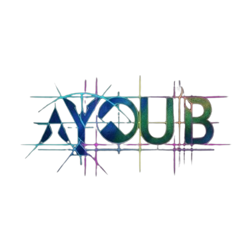

# 🧮 AYOUB.PW — آلة حاسبة احترافية

<div align="center">



**آلة حاسبة ويب احترافية مع تأثيرات بصرية مذهلة**

[](https://ayoub.pw)
[](https://developer.mozilla.org/en-US/docs/Web/HTML)
[](https://developer.mozilla.org/en-US/docs/Web/CSS)
[](https://developer.mozilla.org/en-US/docs/Web/JavaScript)

</div>

---

## ✨ المميزات

- 🖱️ **تتبع الماوس بنقاط ملونة** — جسيمات سريعة تتبع حركة الماوس بتأثيرات نيون
- 💥 **انفجار جسيمات عند النقر** — تأثير بصري عند كل ضغطة
- 🌐 **شبكة خلفية متحركة** — نقاط مترابطة بخطوط متوهجة
- 🎨 **تصميم نيون داكن** — ألوان سيان وبنفسجي وردي على خلفية كونية
- ⌨️ **دعم الكيبورد الكامل** — اكتب الأرقام والعمليات مباشرة
- 📱 **متجاوب** — يعمل على الموبايل والديسكتوب
- ⚡ **سريع وخفيف** — ملف HTML واحد بدون مكتبات خارجية

---

## 🗂️ هيكل الملفات

```
ayoub-calculator/
├── index.html              # الصفحة الرئيسية (الموقع كامل)
├── ayoub_logo_512x512.png  # اللوجو الرئيسي
└── README.md               # هذا الملف
```

---

## 🚀 طريقة الرفع

### الخيار 1 — رفع مباشر على السيرفر

```bash
# ارفع الملفين على السيرفر في نفس المجلد
scp index.html user@ayoub.pw:/var/www/html/
scp ayoub_logo_512x512.png user@ayoub.pw:/var/www/html/
```

### الخيار 2 — Vercel (مجاني وسريع)

```bash
# تثبيت Vercel CLI
npm install -g vercel

# رفع المشروع
cd ayoub-calculator
vercel --prod
```

### الخيار 3 — GitHub Pages

```bash
git init
git add .
git commit -m "🚀 Initial commit - AYOUB Calculator"
git branch -M main
git remote add origin https://github.com/USERNAME/ayoub-calculator.git
git push -u origin main
```
ثم فعّل **GitHub Pages** من إعدادات الريبو → Source: `main branch`

### الخيار 4 — Cloudflare Pages

```bash
# ارفع المجلد مباشرة على dash.cloudflare.com
# Workers & Pages → Create application → Pages → Upload assets
```

---

## ⌨️ اختصارات الكيبورد

| المفتاح | الوظيفة |
|---------|---------|
| `0-9` | إدخال الأرقام |
| `+` `-` `*` `/` | العمليات الحسابية |
| `Enter` أو `=` | حساب النتيجة |
| `.` | نقطة عشرية |
| `Escape` | مسح الكل |
| `Backspace` | حذف آخر رقم |

---

## 🧮 العمليات المدعومة

| العملية | الرمز |
|---------|-------|
| الجمع | `+` |
| الطرح | `−` |
| الضرب | `×` |
| القسمة | `÷` |
| النسبة المئوية | `%` |
| تغيير الإشارة | `+/-` |

---

## 🛠️ التقنيات المستخدمة

- **HTML5** — هيكل الصفحة
- **CSS3** — التصميم والتأثيرات (Animations, Gradients, Glass morphism)
- **Vanilla JavaScript** — منطق الآلة الحاسبة ونظام الجسيمات
- **Canvas API** — رسم الجسيمات والتأثيرات البصرية
- **Google Fonts** — خط Orbitron + Cairo

---

## 📸 لقطة الشاشة

> تصميم نيون داكن مع تأثيرات جسيمات تفاعلية وخلفية شبكية متحركة

---

## 👤 المطور

**أيوب**
- 🌐 [ayoub.pw](https://ayoub.pw)
- 📧 [contact@ayoub.pw](mailto:info@ayoub.pw)

---

## 📄 الرخصة

```
MIT License — حر الاستخدام والتعديل
© 2026 AYOUB.PW
```
